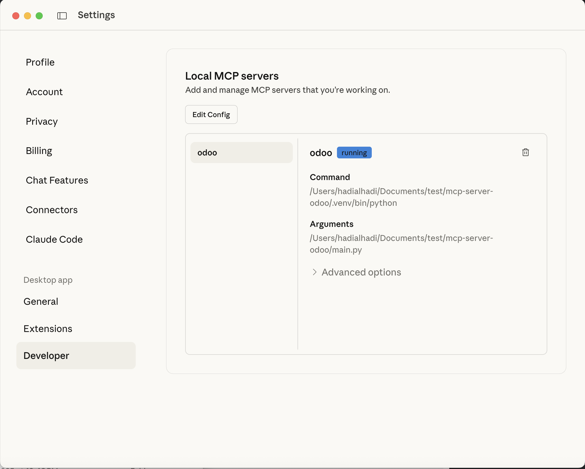

# 🐍 Odoo MCP Server

This project provides a **lightweight, experimental Model Context Protocol (MCP) server** for integrating with **Odoo** via XML-RPC.  
It is primarily designed for use with [Claude Desktop](https://claude.ai), enabling AI tools to query and analyze a wide range of Odoo accounting data.  

---

### 🔍 Example: Claude Detecting MCP Tool




## 🚀 Key Features

- **Secure Odoo Connection:** Establish a secure connection to your Odoo instance using environment variables or a dedicated configuration file.
- **Accounting Data Tools:** Provides specialized tools to efficiently search and retrieve relevant accounting information:
  - Journal Entries: Access and analyze posted journal entries
  - Invoices & Bills: Retrieve customer invoices, vendor bills, and credit notes
  - Chart of Accounts: Access account hierarchy and balances for GL accounts, bank accounts, etc.
  - Partners: Retrieve customer and vendor information including contact details
  - Journals: Access journal types and settings for sales, purchases, bank, cash, etc.
  - Analytic Accounts: Retrieve project and cost center information for financial analysis
- **Claude AI Ready:** Fully compliant with the Model Context Protocol, ensuring smooth integration with Claude Desktop.
- **RESTful API (via FastAPI):** Offers a simple and robust FastAPI server for exposing RESTful endpoints.
- **Flexible Configuration:** Easily configure the server through Claude Desktop's configuration settings.

---

## 🏗️ Setup Guide

Follow these steps to set up and run the Odoo Accounting MCP Server:

### 1. 📅 Clone the Repository

```bash
git clone https://github.com/hadi-alhadi/mcp-server-odoo.git
cd mcp-server-odoo
```

### 2. 🔧 Configure Environment Variables

Create a `.env` file in the project's root directory and populate it with your Odoo connection details:

```ini
ODOO_URL=http://localhost:8069
ODOO_DB=your_db_name
ODOO_USERNAME=your_odoo_user_name
ODOO_PASSWORD=your_odoo_password
```

### 3. 🏗️ Set Up Virtual Environment

It's recommended to use a virtual environment to manage project dependencies:

```bash
python -m venv .venv
```

Activate it:

```bash
.\.venv\Scripts activate
```

### 4. 📁 Install Dependencies

Install the required Python packages from the `requirements.txt` file:

```bash
python -m pip install -r requirements.txt
```

### 5. 🚀 Run the Server (optional, not required)

Start the MCP server using the main Python script:

```bash
python main.py
```

The server will typically start and be accessible at `http://localhost:8000`.

---

## 🔌 Claude Desktop Integration

You don't need to manually run the MCP server when using Claude Desktop. Instead, configure Claude Desktop to manage the server lifecycle.

Update your `claude_desktop_config.json` file with the following configuration (adjust the paths and Odoo credentials as necessary):

```json
{
  "mcpServers": {
    "odoo": {
      "command": "/path/to/repo/mcp-server-odoo/.venv/bin/python",
      "cwd": "/path/to/repo/mcp-server-odoo",
      "args": ["/path/to/repo/mcp-server-odoo/main.py"],
      "env": {
        "ODOO_URL": "http://localhost:8069",
        "ODOO_DB": "your_db",
        "ODOO_USERNAME": "admin",
        "ODOO_PASSWORD": "your_password"
      }
    }
  }
}
```

---

## 📁 License

This project is licensed under the MIT License.
